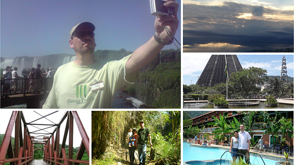

# BIOGRAFIA DE NICOLAS MOLINA GONZALEZ

## Datos personales

* Fecha de nacimiento: 9 de septiembre de 1972
* Nacionalidad: Boliviano
* Estado civil: Casado
* Dirección: Avenida Hugo Ernest 6780, Bajo Següencoma. La Paz - Bolivia
* Idiomas:
  + Español (Nativo)
  + Inglés (Lee y escribe, IELTS banda 8)
  + Portugués (Básico)
* Celular: 70166656
* Correo electrónico: [nmolinag@gmail.com](nmolinag@gmail.com)
* Perfil en LinkedIn: [www.linkedin.com/in/molinanicolas](www.linkedin.com/in/molinanicolas)

## Historial académico

* __Universidad Mayor de San Andrés – La Paz, Bolivia__
  + Carrera de Estadística
  + 2014 a la fecha
* __Universidad de Viña del Mar – Viña del Mar, Chile__
  + Maestría en Administración de Empresas con especialidad en Dirección de Proyectos
  + 2012
* __Centro de Ingenieros Alemanes en la Argentina – VDIA y Deutsche Gesellschaft für Qualität e.V. - DGQ__
  + Auditor Interno de Calidad (Qualitatsbeauftragter und Interner Auditor) ISO-9000 (Bloque QM-PyMEs)
  + 1999
* __Universidad Mayor de San Andrés – La Paz, Bolivia__
  + Licenciatura en Ingeniería Industrial
  + 1996
* __Colegio San Calixto – La Paz, Bolivia__
  + Bachiller en humanidades
  + 1990

## Cita

> "La política es el arte de buscar problemas, encontrarlos, hacer un diagnóstico incorrecto y aplicar después los remedios equivocados" - Groucho Marx

## Aficiones

### Cocinar y probar todo tipo de comida

### Viajes en familia

